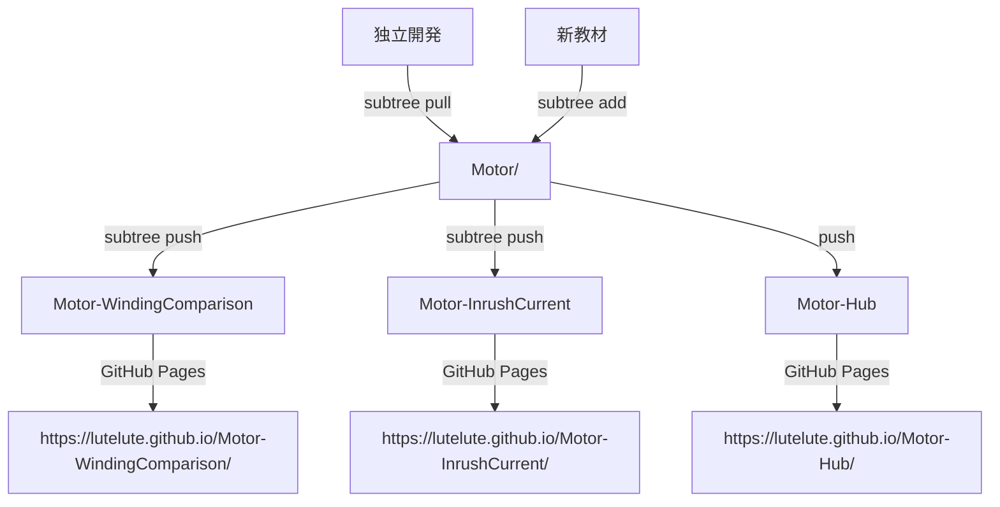

# 🔍 プロジェクト状態確認ガイド

## 🤖 Claude向け: プロジェクト理解のための確認項目

新しいセッションでこのプロジェクトを引き継ぐ際は、以下の順序で状況を把握してください。

## 📋 基本情報確認

### 1. 現在の作業ディレクトリ確認
```bash
pwd
ls -la
```

### 2. Gitリポジトリ状態確認
```bash
# リモートリポジトリ一覧
git remote -v

# 現在のブランチとコミット状況
git status
git log --oneline -5

# subtree関連のコミット履歴
git log --grep="subtree\|Subtree" --oneline -10
```

### 3. GitHub CLI認証状態確認
```bash
gh auth status
gh repo list --limit 5
```

## 🌐 現在のプロジェクト構成

### リポジトリ構成 (2024年12月時点)

1. **Motor-Hub** (統合ハブ)
   - URL: https://github.com/lutelute/Motor-Hub
   - Pages: https://lutelute.github.io/Motor-Hub/
   - 役割: 教材ポータルサイト

2. **Motor-WindingComparison** (巻線方式比較)
   - URL: https://github.com/lutelute/Motor-WindingComparison  
   - Pages: https://lutelute.github.io/Motor-WindingComparison/
   - 役割: 集中巻き vs 分布巻き比較シミュレーター

3. **Motor-InrushCurrent** (突入電流解析)
   - URL: https://github.com/lutelute/Motor-InrushCurrent
   - Pages: https://lutelute.github.io/Motor-InrushCurrent/
   - 役割: モーター始動時電流解析シミュレーター

### 確認コマンド
```bash
# 各リポジトリのPages状態確認
gh api repos/lutelute/Motor-Hub/pages | jq '.html_url'
gh api repos/lutelute/Motor-WindingComparison/pages | jq '.html_url'  
gh api repos/lutelute/Motor-InrushCurrent/pages | jq '.html_url'
```

## 🔄 Git Subtree関係図



## 📁 ローカルファイル構成

### 現在のMotor/フォルダ構成
```
Motor/
├── README.md                              # プロジェクト全体概要
├── EDUCATIONAL_PROJECT_GUIDE.md           # 開発ガイド
├── PROJECT_STATUS_CHECK.md               # このファイル
├── .gitignore                             # Git無視ファイル
├── concentrated_vs_distributed_winding/   # 巻線比較教材(subtree)
│   ├── index.html
│   ├── claude_ver/
│   └── genspark_ver/
└── inrush/                                # 突入電流教材(subtree)
    ├── index.html
    └── jsx/
```

### 確認方法
```bash
# ディレクトリ構造確認  
tree -L 3 || ls -la

# 各教材フォルダの内容確認
ls concentrated_vs_distributed_winding/
ls inrush/

# HTMLファイル存在確認
find . -name "*.html" -type f
```

## 🎯 一般的な作業パターン

### パターンA: 既存教材の修正

1. **対象教材の特定**
```bash
# どの教材を修正するか確認
ls concentrated_vs_distributed_winding/
ls inrush/
```

2. **修正作業実行**
```bash
# ローカルファイル編集
# Edit/Write ツールで修正

# コミット
git add [修正ファイル]
git commit -m "Fix: [修正内容]"
```

3. **独立リポジトリへの反映**
```bash
# subtree pushで修正を各リポジトリに反映
git subtree push --prefix=concentrated_vs_distributed_winding winding-origin main
# または
git subtree push --prefix=inrush inrush-origin main
```

### パターンB: 新教材の追加

1. **新しい独立リポジトリ作成**
```bash
gh repo create Motor-[教材名] --public --description "[説明]"
```

2. **ローカル教材開発**
```bash
# 新しい教材フォルダ作成
mkdir [新教材名]/
# ... 開発作業 ...

# コミット
git add [新教材名]/
git commit -m "Add: [教材名] simulator"
```

3. **subtreeで分離**
```bash
git remote add [教材名]-origin https://github.com/lutelute/Motor-[教材名].git
git subtree push --prefix=[新教材名] [教材名]-origin main
```

### パターンC: ハブの更新

```bash
# Motor-Hubリポジトリへの反映
git push hub-origin main

# Pages反映確認
gh api repos/lutelute/Motor-Hub/pages/builds -X POST
```

## ⚠️ 注意すべきポイント

### Git Subtree操作時
```bash
# subtreeプッシュが失敗する場合
git subtree push --prefix=[path] [remote] main --squash

# conflictが発生した場合
git subtree pull --prefix=[path] [remote] main --strategy=subtree -Xsubtree=[path]
```

### GitHub Pages反映
- 変更後、2-5分程度で反映される
- 反映されない場合は強制ビルド実行

### 開発時の注意
- CDN依存ライブラリは可用性を確認
- モバイル対応の動作確認必須
- 全主要ブラウザでのテスト推奨

## 🚀 次の拡張予定

### 計画中の教材
1. **Motor-EfficiencyAnalysis** - 効率解析教材
2. **Motor-VibrationNoise** - 振動・騒音解析教材  
3. **Motor-ControlTheory** - 制御理論基礎教材
4. **Motor-DesignOptimization** - 設計最適化教材

### 技術改善項目
- [ ] 統一UI/UXライブラリの導入
- [ ] 共通コンポーネント集の作成
- [ ] 自動テスト環境の構築
- [ ] 多言語対応の検討

## 💡 Claudeへの作業依頼例

### 効果的な依頼方法

#### 👍 Good Examples:
```
"巻線比較教材のトルクリップル計算精度を向上させてください"
"新しい効率解析教材を作成し、subtreeで独立リポジトリ化してください"  
"全教材のモバイル対応を改善してください"
```

#### 👎 Avoid:
```
"何かやって" (具体性がない)
"全部変更して" (範囲が広すぎる)
"直して" (問題が不明確)
```

### 情報共有のお願い
- 作業前に現状確認コマンドの実行
- 変更内容の明確な説明
- テスト・検証結果の報告
- 問題発生時の詳細なエラー情報

---

**📝 更新履歴:**
- 2024/12/01: 初版作成
- Git subtree分離構成の設定完了
- GitHub Pages自動配信設定完了