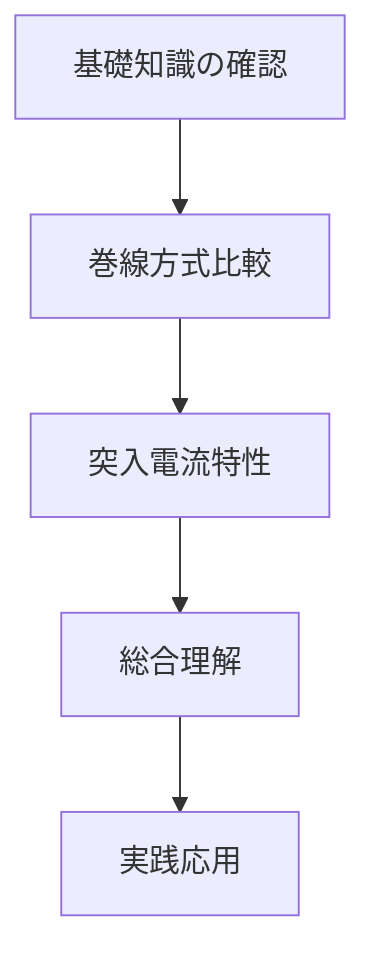

# ⚡ モーター学習教材プロジェクト

モーター工学の理論と実践を学ぶためのインタラクティブ教材集です。視覚的なシミュレーションを通じて、モーターの動作原理と特性を深く理解できます。

## 📚 教材一覧

### 1. 巻線方式比較シミュレーター
**集中巻きと分布巻きの特性比較**

| 項目 | 内容 |
|------|------|
| 📁 **フォルダ** | [`concentrated_vs_distributed_winding/`](./concentrated_vs_distributed_winding/) |
| 🎯 **目的** | ブラシレスモーターの巻線方式による特性差を理解 |
| 🔧 **シミュレーター** | Claude版 & Genspark版 |
| 📖 **学習内容** | トルクリップル、高調波、効率、製造性の比較 |

**🚀 ライブデモ:**
- [メインページ](./concentrated_vs_distributed_winding/index.html)
- [Claude版シミュレーター](./concentrated_vs_distributed_winding/claude_ver/brushless_motor_sim.html)
- [Genspark版シミュレーター](./concentrated_vs_distributed_winding/genspark_ver/brushless_motor_simulator.html)

### 2. 突入電流シミュレーター
**モーター始動時の電流波形解析**

| 項目 | 内容 |
|------|------|
| 📁 **フォルダ** | [`inrush/`](./inrush/) |
| 🎯 **目的** | 各種モーターの始動特性と突入電流の理解 |
| 🔧 **対象モーター** | かご型誘導機、巻線型誘導機、同期機 |
| 📖 **学習内容** | DC成分、投入位相角、減衰特性 |

**🚀 ライブデモ:**
- [突入電流シミュレーター](./inrush/index.html)

## 🎓 学習効果

### 基礎理論の理解
- **視覚的学習**: 複雑な数式や理論を直感的に理解
- **パラメータの影響**: リアルタイムでの特性変化観察
- **比較学習**: 複数の方式・種類の定量的比較

### 実践的スキルの習得
- **設計判断**: トレードオフの理解と最適解の模索
- **問題解決**: 現象の原因分析と対策検討
- **エンジニアリング**: 理論と実用のバランス感覚

## 🛠️ 技術仕様

### フロントエンド技術
- **HTML5/CSS3**: レスポンシブデザイン
- **JavaScript/React**: インタラクティブUI
- **Canvas/SVG**: 高性能グラフィックス
- **Recharts**: データ可視化ライブラリ

### GitHub Pages対応
- 静的サイトとして配信
- モバイル・タブレット対応
- 高速ロード最適化

## 📖 使用方法

### 基本的な学習フロー

1. **📋 概要理解**
   - 各教材の目的と学習内容を確認
   - 前提知識の整理

2. **🎮 シミュレーション実行**
   - パラメータを調整して特性変化を観察
   - 複数のケースでの比較分析

3. **📊 結果解釈**
   - グラフやデータの読み取り
   - 物理現象との関連付け

4. **🎯 実践応用**
   - 設計課題への適用
   - 最適化の検討

### 推奨学習順序



## 📁 プロジェクト構成

```
Motor/
├── README.md                              # このファイル
├── concentrated_vs_distributed_winding/   # 巻線方式比較
│   ├── index.html                         # メインページ
│   ├── README.md                          # 詳細説明
│   ├── claude_ver/                        # Claude作成版
│   │   ├── brushless_motor_sim.html      # 詳細解析シミュレーター
│   │   ├── README.md                     # 技術ドキュメント
│   │   └── ...                           # GitHub関連ファイル
│   ├── genspark_ver/                     # Genspark作成版
│   │   ├── brushless_motor_simulator.html # 直感的UIシミュレーター
│   │   └── README.md                     # 使用ガイド
│   ├── concentrated/                     # 集中巻き詳細（拡張用）
│   ├── distributed/                      # 分布巻き詳細（拡張用）
│   └── comparison/                       # 比較結果（拡張用）
└── inrush/                               # 突入電流解析
    ├── index.html                        # メインシミュレーター
    └── jsx/                              # React JSXソース
        └── motor-inrush-simulator.jsx    # 開発用ソース
```

## 🎯 対象読者

### 👥 主要ターゲット
- **工学部学生**: 電気・機械・制御系専攻
- **エンジニア**: モーター設計・制御関連
- **研究者**: 回転機・パワエレ分野
- **技術者**: 保守・運用担当者

### 📋 前提知識
- **基礎数学**: 三角関数、複素数、微分積分
- **電気工学**: 交流理論、電磁気学基礎
- **回転機**: モーターの基本構造（推奨）

## 🔗 参考文献・資料

### 📚 推奨教科書
- Electric Machinery Fundamentals - Stephen J. Chapman
- Brushless Permanent Magnet Motor Design - Dr. Duane Hanselman
- Electric Motor Drives - R. Krishnan
- Design of Rotating Electrical Machines - Juha Pyrhönen

### 🌐 関連リンク
- [PWEL ワークショップ資料](https://example.com/pwel-workshop)
- [IEEEXplore - Motor Design Papers](https://ieeexplore.ieee.org)
- [Motor Design Online Course](https://example.com/motor-course)

## 🤝 貢献ガイド

### 💻 コントリビューション歓迎
- **バグ報告**: Issues での不具合報告
- **機能要望**: 新しい教材やシミュレーション
- **ドキュメント改善**: 説明の充実・多言語化
- **コード最適化**: パフォーマンス・UI改善

### 📝 開発方針
- **教育効果最優先**: わかりやすさと正確性
- **アクセシビリティ**: 誰でも使える設計
- **オープンソース**: 知識共有とコラボレーション
- **持続可能性**: 長期的な保守・拡張性

## 🆔 ライセンス

### 📄 使用許諾
このプロジェクトは教育目的での自由な利用を前提としています：
- **学術利用**: 無制限での使用・改変・配布可能
- **商用利用**: 要相談（教育目的に限る）
- **再配布**: オリジナル作者クレジット必須

### ⚠️ 免責事項
- 教育・学習目的のシミュレーションです
- 実際の設計には専門ソフトウェアと物理試験が必要
- 計算結果の工学的正確性は参考程度に留めてください

---

**🎯 目標**: モーター工学の理論と実践を橋渡しし、次世代エンジニアの育成に貢献する

**🚀 Made with AI** 🤖 | **Educational Open Source** 📚 | **Collaborative Learning** 🤝
